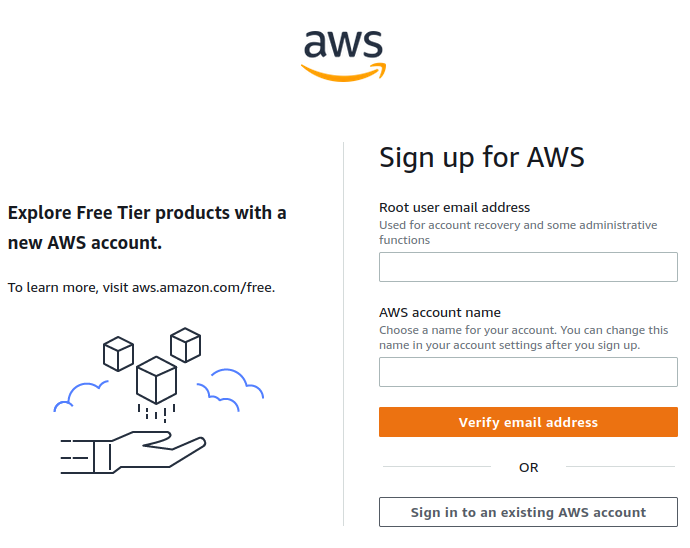
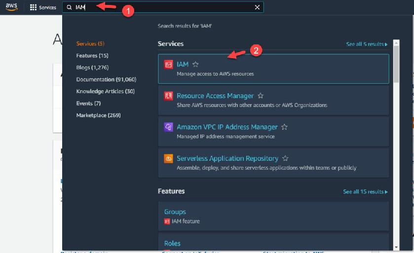
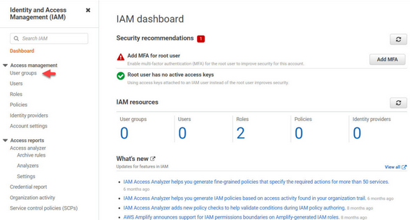
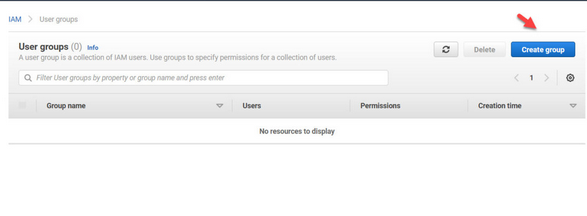

# [DevOps] RaroTalks
# <span style="font-size: 50px;color: blue; font-size:50px;">Infraestrutura como código na AWS</span>

## Requisitos

- [AWS CLI - Linux](https://docs.aws.amazon.com/cli/latest/userguide/getting-started-install.html)
- [Terraform CLI](https://www.terraform.io/downloads)
- [Workspace - GitPod](https://gitpod.io#snapshot/77d0cdb0-1d2e-443c-b114-307f2751b2fa)

## Criar conta na AWS

<p align="center">
    
</p>

<br>

```
💡 Atenção: Alguns recursos da AWS são pagos, porém, é disponibilizado na plataforma alguns recursos gratuitos (como é o caso do EC2).

Neste Hands-On, utilizaremos apenas serviço de computação em Nuvem: EC2 Free Tier no qual pode ser utlizado até 750h/mês por até 1 ano.
```
<br>

- Basta clicar nesse link e preencher com seus dados de acesso e ir seguindo o passo a passo da pagina da [AWS](https://portal.aws.amazon.com/billing/signup);

<p align="center">
    
</p>

* Preencher os campos:

    - Email;
    - Nome;
    - Valide o código enviado para o email;
    - Preencha o seu endereço/cep;
    - Preencha os dados do cartão de crédito (Será cobrado um valor apenas para validar o cartão, depois será estornado);
    - Selecione o Plano: Basic support - Free;

2. Acesse o [Console da AWS](https://signin.aws.amazon.com/signin?redirect_uri=https%3A%2F%2Fus-east-1.console.aws.amazon.com%2Fconsole%2Fhome%3FhashArgs%3D%2523%26isauthcode%3Dtrue%26nc2%3Dh_ct%26region%3Dus-east-1%26skipRegion%3Dtrue%26src%3Dheader-signin%26state%3DhashArgsFromTB_us-east-1_da51730ebeca3875&client_id=arn%3Aaws%3Asignin%3A%3A%3Aconsole%2Fcanvas&forceMobileApp=0&code_challenge=4YH_yU7SUQDvw0sWU-poHgwA7b_k1WjKfvhXjJnd2MI&code_challenge_method=SHA-256) com a sua conta recem criada;

## Crie um usuário no console do IAM:

- Na tela AWS Management Console pesquise por IAM.

<p align="center">

</p>

- Na tela Identity and Access Management (IAM) em Access management clique em user groups:

<p align="center">

</p>

- Na tela User groups clique em Create group:

<p align="center">

</p>

- Na tela Create user group em User group name digite um nome para o grupo em Attach permissions policies https://github.com/rnraro/rarotalks-devops
- Ainda na tela <b>Identity and Access Management (IAM)</b> em Access management clique em Users.

- Na tela Users clique em <b>Add users.</b>

- Na tela Add user em User name digite o nome de usuário, ex: terraform, podemos selecionar dois tipos de acesso para o usuário <b>Programmatic access</b> e <b>AWS Management Console access</b> - Neste HandsOn usaremos apenas o usuário <b>Programático</b>.

- Crie o usuário e adicione-o ao Grupo <b>EC2_Group</b>;

- Ao final da criação do usuário salve o <b>ID da Chave de acesso</b> e também a <b>Chave de acesso Secreta</b>. Você também pode fazer o download do CSV com estas informações, usaremos estes dados adiante.

## Configurar o usuário no GitPod

- Crie a conta na plataforma ou sincronize com a sua conta do Github;
- Acesse a o Workspace com os projetos:

[Workspace - Gitpod](https://gitpod.io#snapshot/77d0cdb0-1d2e-443c-b114-307f2751b2fa)

## Referências

- [Intro - Terraform](https://www.terraform.io/intro);
- [Terraform Get Started](https://learn.hashicorp.com/collections/terraform/aws-get-started?utm_source=WEBSITE&utm_medium=WEB_IO&utm_offer=ARTICLE_PAGE&utm_content=DOCS);
- ;
- ;